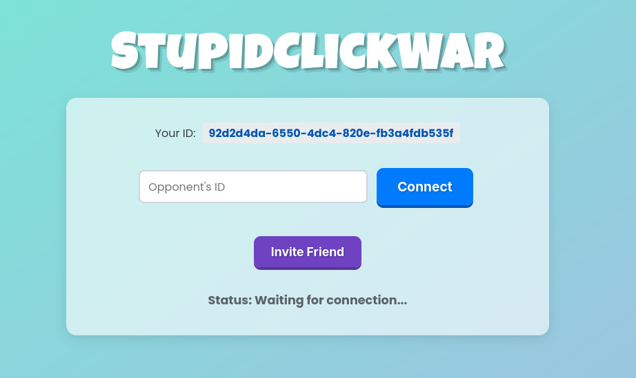

# StupidClickWar

 <!-- Replace with your repo link -->

A simple, frantic, real-time two-player online clicking game built with PeerJS for direct browser-to-browser connection. Challenge your friends to see who has the fastest fingers!

## Description

StupidClickWar pits two players against each other in a test of clicking speed. Players connect directly using PeerJS IDs. Once connected and ready, a countdown begins, followed by a timed round where each player clicks their button as rapidly as possible. Clicks contribute to pushing a central "tug-of-war" bar towards the opponent's side. The first player to push the bar fully, or the player with the most progress when time runs out, wins the round.

This project demonstrates the use of PeerJS for simple WebRTC data connections, managing game state between two clients, and basic DOM manipulation for UI updates and feedback.

## Screenshot

<!-- Make sure screenshot.png is in the root directory of your repository, or update the path accordingly -->

## Features

*   **Real-time Two-Player Gameplay:** Connect directly with one other player.
*   **Peer-to-Peer Connection:** Uses PeerJS (WebRTC) for direct browser connections, requiring no central game server for gameplay logic.
*   **ID-Based Connection:** Simple system using unique PeerJS IDs to connect.
*   **Invite Link System:** Generate and share a link to easily invite a friend to connect.
*   **Visual Tug-of-War Bar:** See your progress against your opponent in real-time.
*   **Timed Rounds:** Each round lasts 20 seconds after a 5-second countdown.
*   **Win Conditions:** Win by pushing the bar fully to the opponent's side or by having pushed it further when time expires.
*   **Ready System:** Both players must signal they are ready before a round starts.
*   **Play Again:** Option to quickly start a new round after one finishes.
*   **Visual Feedback:** Bar shakes on clicks, confetti effect on winning.

## How to Play

1.  **Get Your ID:** The first player (Player 1) opens the game. Their unique ID will appear under "Your ID:".
2.  **Share ID or Link:**
    *   Player 1 copies their ID and sends it to Player 2.
    *   Alternatively, Player 1 clicks "Invite Friend" to generate a shareable link and sends that to Player 2.
3.  **Connect:**
    *   If using ID: Player 2 pastes Player 1's ID into the "Opponent's ID" field and clicks "Connect".
    *   If using Link: Player 2 opens the invite link, which should pre-fill the ID and attempt to connect automatically.
4.  **Get Ready:** Once connected ("Status: Connected to..."), both players click the "I'm Ready!" button.
5.  **Countdown:** A 5-second countdown will start.
6.  **CLICK!:** When "GO!" appears and the main button activates, click it as fast as you can! Watch the tug-of-war bar move.
7.  **Win/Lose/Draw:** The game ends when time runs out or one player pushes the bar completely. The result is displayed.
8.  **Play Again:** After a brief delay, the "Play Again?" button becomes active. Both players click it to start the process over from Step 4.

## Built With

*   HTML5
*   CSS3
*   JavaScript (ES6+)
*   PeerJS - For WebRTC peer-to-peer connections.
*   Canvas Confetti - For the win celebration effect.
*   Google Fonts - (Poppins, Luckiest Guy)

## Contributing

Contributions are welcome! If you have suggestions or find bugs, please open an issue on the GitHub repository. If you'd like to contribute code, please fork the repository and submit a pull request.

## License

This project is licensed under the MIT License - see the `LICENSE.md` file for details (if you add one).
